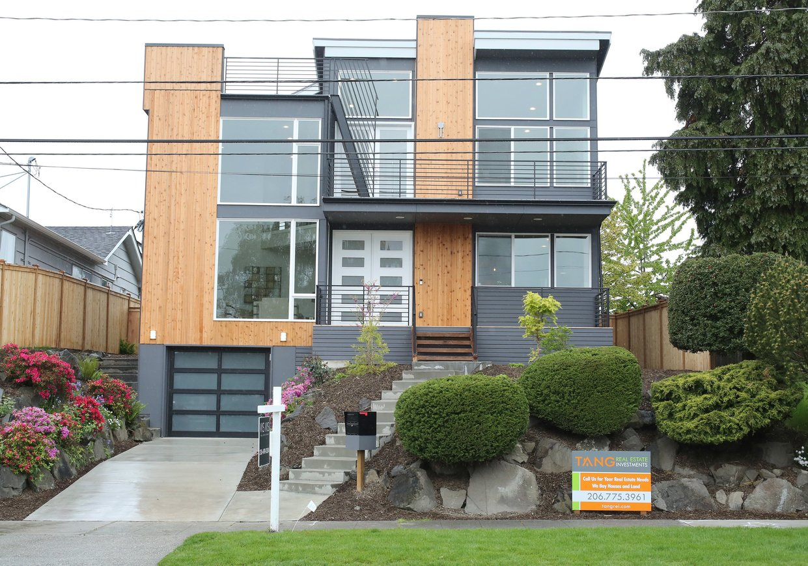

# Welcome to our Shiny Application. 

Our application helps you find the best fit home for you within King County. We pull from a dataset of over 20,000 observations and filter nine different features. Our navigation bar allows you to easily narrow down your search based on the number of rooms and bathrooms, price range, location, condition of the house, and square footage. This data also shows what features lead to a greater probability of making a sale in a given region, giving sellers a glimpse into the likelihood of success in the market. 

Our application is organized into several tabs, including, a map that shows the homes within King County alongside a navigation bar with filtering capabilities. The next tab shows a table that lists homes that fall into your specific filters as it shows the exact price, square footage, and number of rooms of particular homes.  

